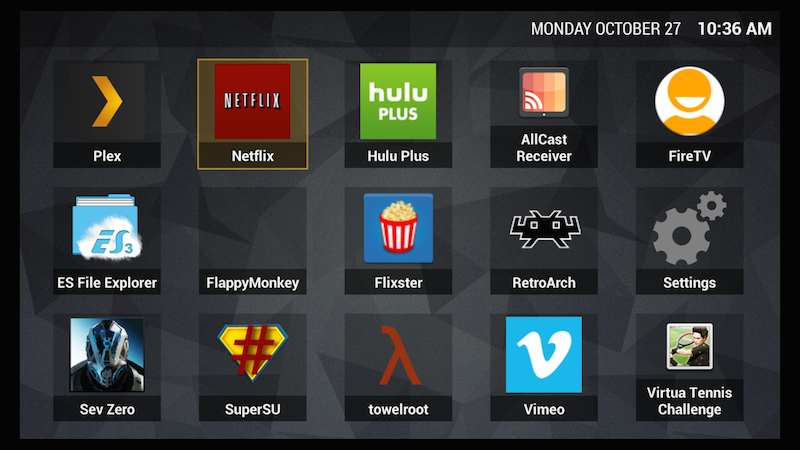

# FiredTV Launcher

FiredTV Launcher is a 'replacement' for Amazon's Home/Launcher app which does not show sideloaded apps.

###How does it work?
While it's not possible (yet/without root) to actually replace the launcher app, FiredTV effectively does this by watching for Amazon's launcher being opened, and then immediately launches itself.  Because of this, you will see Amazon's home screen flash on the screen very briefly after pressing the home button, before FiredTV Launcher appears.

###Installation
First, head over to the [Releases Page](https://github.com/Redth/FiredTVLauncher/releases) and get the latest version .apk file.

Once you've downloaded the file, follow these steps:

1. Find the IP address of your FireTV (you can do this by going into the settings)
2. Open a Terminal, you're going to sideload the .apk to your FireTV
3. `adb connect xxx.xxx.xxx.xxx` to connect to your FireTV where xxx.xxx.xxx.xxx is the IP address of your FireTV
4. `adb install /path/to/com.altusapps.firedtvlauncher-1.x.x.apk` to install the app to your device
5. On your FireTV, open the settings
6. Go into Applications
7. Find 'FiredTV' in the list, and select it
8. Select 'Launch Application'

###Where's the Java?
If you looked at the source, you may have noticed that there's no Java.  That's because this was written entirely in C# using [Xamarin](http://xamarin.com)!  C# is awesome, go use Xamarin!

###What's next?
Obviously this launcher is very simple, and there's not much to it.  I'm planning on adding some Settings configuration within the app, so you can do things like hide apps, reorder them, hide labels, change colors, etc.

If you have a feature you really want, open an issue here!

###Thanks
Do you like this project?  I'd be ever so grateful if you bought me a beer!
[Donate now, via PayPal](https://www.paypal.com/cgi-bin/webscr?cmd=_s-xclick&hosted_button_id=2GQPW92YLPY56)